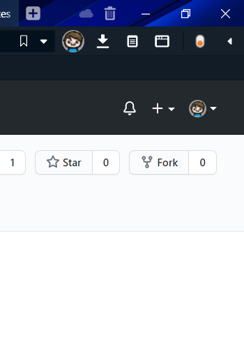

# Vivaldi Sidebar Remover

This modification moves the buttons from the sidebar next to the address bar and hides the sidebar to use the browser screen space more effectively while not giving up the functionality of the sidebar buttons.

### Cool but what does it look like?

Like this

  

### Installation

#### Windows

Execute the `apply-mod.bat` in the `mod` folder.

#### Linux

Move the `browser.html` and `sidebar-removal.js` to your `vivaldi ` folder located in `Vivaldi\Application\[VERSION]\resources\vivaldi` with `[VERSION]` being the current installation's version number.

### Known Issues

Currently, while this mod is active you wont be able to customize the button layout comfortably. However using the Panels entry in the right click menu works if you restart the browser afterwards.